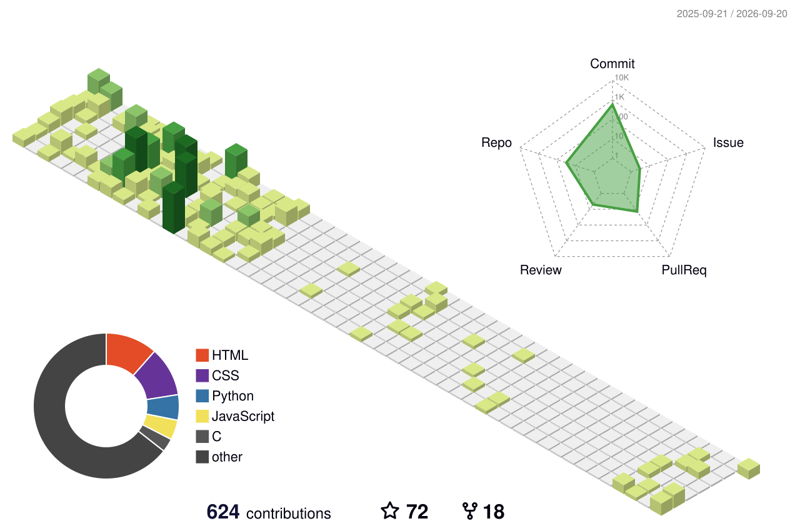

<!-- ============================================================
     BI7KHI · GitHub Profile README
     如需替换用户名：全局搜索 BI7KHI 即可。
     ============================================================ -->

<!-- 打字机标题 -->

<!-- 个人信息徽章 -->

  
  
  
  

---

## 🧑‍💻 关于我 · About Me

<table>
<tr>
<td width="62%" valign="top">

- 🎓 就读于 **广东工业大学** · 机械设计制造及其自动化
- 📻 业余无线电爱好者，呼号 **BI7KHI** · [广工无线电社](https://github.com/GDUTRadioClub) 成员
- 🔧 嵌入式开发：**STM32 / ESP32 / 树莓派 / Rockchip RK3588**，从裸机到 RTOS 都折腾
- 🚁 无人机与飞控：**PX4 / NuttX** 移植与二次开发（DM-MC02 · STM32H723）
- 🛰️ 射频与通信：**GNU Radio · MMDVM · SDR · ExpressLRS**，业余无线电软硬件一把梭
- 🛠️ 上位机 & 全栈：用 Python / JavaScript 写给自己用的调试工具
- 🧠 端侧 AI 探索：中继台集成端侧 LLM + TTS + Agent 工具链
- ⚡ 折腾不止：Arch Linux · Neovim · 各种奇怪的 PCB
- 📝 日常记录在 [个人博客](https://blog.bi7khi.xyz)

</td>
<td width="38%" align="center" valign="top">

**Xuanna024** ｜ `BI7KHI`

📍 Guangzhou, China 
🏫 GDUT · Mechanical Engineering 
📡 HAM Radio Operator 
🔗 [blog.bi7khi.xyz](https://blog.bi7khi.xyz)

</td>
</tr>
</table>

---

## 🛠️ 技术栈 · Tech Stack

**⌨️ 编程语言 · Languages**

**🔌 嵌入式 / 硬件 · Embedded & Hardware**

**📡 无线电 / 射频 · RF & Radio**

**🧰 工具 / 环境 · Tools & Environment**

**🌍 语言 · Spoken Languages**

---

## 📊 GitHub 状态 · GitHub Stats

<!-- 综合概览 -->

<!-- 统计数据 + 仓库语言占比 -->

<!-- 提交语言占比 + 高效时段（UTC+8） -->

<!-- 连续贡献 -->

<!-- 成就奖杯（官方实例负载已满，此处使用社区镜像，可自行替换） -->

---

## 🌈 3D 贡献图 · 3D Contribution Graph

<picture>
  <source media="(prefers-color-scheme: dark)" srcset="./profile-3d-contrib/profile-night-rainbow.svg" />
  <source media="(prefers-color-scheme: light)" srcset="./profile-3d-contrib/profile-green-animate.svg" />
  
</picture>

由 <a href="https://github.com/yoshi389111/github-profile-3d-contrib">github-profile-3d-contrib</a> 每日自动生成 · 首次如未显示，请在 <b>Actions</b> 中手动运行一次 <code>GitHub-Profile-3D-Contrib</code>

---

## 🐍 贡献贪吃蛇 · Contribution Snake

<picture>
  <source media="(prefers-color-scheme: dark)" srcset="https://raw.githubusercontent.com/BI7KHI/BI7KHI/output/github-snake-dark.svg" />
  <source media="(prefers-color-scheme: light)" srcset="https://raw.githubusercontent.com/BI7KHI/BI7KHI/output/github-snake.svg" />
  
</picture>

---

## 🚀 精选项目 · Featured Projects

| 项目 | 简介 | 语言 | Stars |
| :--- | :--- | :---: | :---: |
| 📻 **[HAM_OperationTechnicalVerification](https://github.com/BI7KHI/HAM_OperationTechnicalVerification)** | 业余无线电台操作技术能力验证题库及模拟程序 | `JavaScript` |  |
| 📐 **[CUMCM2025-C](https://github.com/BI7KHI/CUMCM2025-C)** | 2025 全国大学生数学建模竞赛 C 题代码仓库 | `Python` |  |
| ✈️ **[PX4-Autopilot-DMMC02](https://github.com/BI7KHI/PX4-Autopilot-DMMC02)** | PX4 v1.15.4 移植到达妙 DM-MC02 控制板（STM32H723） | `C++` |  |
| 🛰️ **[RockchipRK3588-Smart-Repeater](https://github.com/BI7KHI/RockchipRK3588-Smart-Repeater)** | 多模态中继台：MPPT · 电台控制 · 端侧 LLM + TTS · RTK 基准站 | `C / C++` |  |
| ☀️ **[distributed-pv-auto-cleaner](https://github.com/BI7KHI/distributed-pv-auto-cleaner)** | 无人机 + 地面机器人协作的分布式光伏清洁系统 | `C` |  |
| 🔬 **[GDUT_Physics-Experiment-Report](https://github.com/BI7KHI/GDUT_Physics-Experiment-Report)** | 广东工业大学大学物理实验报告 | `Docs` |  |
| 📶 **[BLE2com](https://github.com/BI7KHI/BLE2com)** | BLE 串口透传调试工具，支持 VOFA+ 与网络透传 | `Python` |  |
| 🔧 **[zskj-canio-tool](https://github.com/BI7KHI/zskj-canio-tool)** | CANIO 数字量输入输出模块上位机（SLCAN / PCAN-Basic） | `Python` |  |

👉 <a href="https://github.com/BI7KHI?tab=repositories">查看全部仓库</a>

---

## 📻 业余无线电 · HAM Radio

<table>
<tr>
<td width="50%" valign="top">

**呼号 · Callsign**

> **BI7KHI** &nbsp;·&nbsp; QTH: 广州 &nbsp;·&nbsp; [QRZ 主页](https://www.qrz.com/db/BI7KHI)

- 🏫 [广工无线电社 GDUTRadioClub](https://github.com/GDUTRadioClub) 成员
- 📚 [GDUT_HAM-Wiki](https://github.com/BI7KHI/GDUT_HAM-Wiki)：基于 Wiki.js 的业余无线电知识库
- 🧪 [HAM_OperationTechnicalVerification](https://github.com/BI7KHI/HAM_OperationTechnicalVerification)：操作证考试题库与模拟程序

</td>
<td width="50%" valign="top">

**折腾方向 · What I Build**

- 🔁 [MMDVM_HS_Dual_Hat](https://github.com/BI7KHI/MMDVM_HS_Dual_Hat)：DMR / MMDVM 数字语音
- 📡 [gnuradio](https://github.com/BI7KHI/gnuradio)：SDR 软件无线电
- 🎮 [ExpressLRS](https://github.com/BI7KHI/ExpressLRS)：高性能开源遥控链路
- 🗼 [RockchipRK3588-Smart-Repeater](https://github.com/BI7KHI/RockchipRK3588-Smart-Repeater)：中继台 + MPPT + 端侧 AI

</td>
</tr>
</table>

---

## 📫 联系我 · Connect

 

> ✨ Focus on Embedded Development & HAM Radio — 持续探索技术边界，欢迎 Star / Fork 交流！
>
> Make Arch Linux Great Again 🐧 &nbsp;·&nbsp; 73!

⭐️ 如果这些项目对你有帮助，欢迎点个 Star 支持一下～

